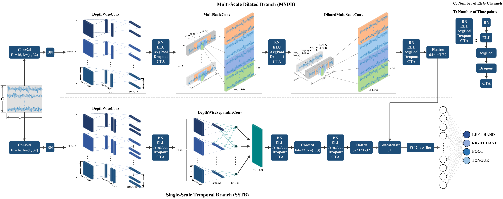

# MS-DBNet

**MS-DBNet: A Heterogeneous Temporal Convolutional Network for Robust Subject-Specific Cross-Session Motor Imagery Decoding**

This is the official code repository for the paper:

> **Fenglin Shi** "MS-DBNet: a heterogeneous temporal convolutional network for robust subject-specific cross-session motor imagery decoding", Proc. SPIE 13940, *International Conference on Machine Learning, Neural Networks, and Computer Software (MLNNCS 2025)*, 139400M (19 November 2025); https://doi.org/10.1117/12.3092280

---

## 1. Introduction

The practical application of motor imagery brain-computer interfaces (MI-BCIs) is hindered by the challenge of **cross-session generalization**. To address this, we propose **MS-DBNet** — a heterogeneous temporal convolutional network that employs a **parallel dual-branch architecture** to complementarily fuse fine-grained local temporal features with robust global contextual features, thereby enhancing robustness against inter-session signal drift.

Cross-session evaluations on five public datasets demonstrate that MS-DBNet **significantly outperforms** existing baseline models, achieving an average accuracy of **86.03%** on BCIC IV 2a.

## 2. Model Architecture

<p align="center">
  
</p>
<p align="center"><b>Figure 1:</b> Overall architecture of MS-DBNet.</p>

MS-DBNet consists of two parallel branches:

| Branch | Name | Role |
|--------|------|------|
| **SSTB** | Single-Scale Temporal Branch | Employs spatial depthwise convolution and single-scale temporal depthwise separable convolution to precisely capture **fine-grained local temporal patterns** at high resolution. |
| **MSDB** | Multi-Scale Dilated Branch | Utilizes multi-scale kernels and dilated convolutions to systematically expand the receptive field, learning **long-range contextual dependencies** tolerant to temporal variations. |

Both branches share a common front-end (Block 1 temporal convolution + Block 2 spatial depthwise convolution), but diverge in their temporal processing blocks:

<table>
<tr><th></th><th>SSTB</th><th>MSDB</th></tr>
<tr><td><b>Block 1</b></td><td>Conv2d, F1=16, k=(1,32)</td><td>Conv2d, F'1=16, k=(1,32)</td></tr>
<tr><td><b>Block 2</b></td><td>DepthwiseConv, D=8, k=(C,1), Pool=(1,8)</td><td>DepthwiseConv, D'=2, k=(C,1), Pool=(1,8)</td></tr>
<tr><td><b>Block 3</b></td><td>SeparableConv, F3=32, k=(1,32), Pool=(1,4)</td><td>MultiScaleConv, F'3=64, k={3,7,15,31}, Pool=(1,4)</td></tr>
<tr><td><b>Block 4</b></td><td>Conv2d, F4=32, k=(1,3), Pool=(1,1)</td><td>DilatedMultiScaleConv, F'4=64, d={1,2,4,8}, Pool=(1,1)</td></tr>
</table>

> All convolutional layers are followed by **BN** and **ELU**. All core blocks are followed by a hybrid **Channel-Time Attention (CTA)** and **Dropout** (p=0.5). After flattening, the features from both branches are concatenated and fed into a fully-connected classifier.

## 3. Experimental Results

### Cross-Session Performance Comparison (Mean % ± Std. Dev.)

| Dataset | FBCSP | EEGNet | DeepConvNet | ShallowConvNet | ATCNet | **MS-DBNet (ours)** |
|---------|-------|--------|-------------|----------------|--------|---------------------|
| **BCIC IV 2a** | 59.07 ±14.27 | 66.67 ±7.90 | 69.52 ±12.37 | 71.45 ±12.02 | 76.20 ±8.79 | **86.03 ±8.01** |
| **BCIC IV 2b** | 67.82 ±13.80 | 75.56 ±10.87 | 73.10 ±13.71 | 68.35 ±13.21 | 76.52 ±12.64 | **77.85 ±11.18** |
| **OpenBMI** | 60.55 ±14.03 | 63.96 ±13.35 | 65.34 ±13.99 | 70.44 ±15.00 | 70.96 ±15.94 | **74.14 ±14.56** |
| **SHU 2C** | 55.42 ±8.55 | 80.83 ±13.63 | 80.33 ±13.40 | 80.15 ±13.35 | 78.62 ±14.08 | **82.79 ±14.63** |
| **SHU 3C** | 39.95 ±7.95 | 68.42 ±15.28 | 70.73 ±10.85 | 67.98 ±12.29 | 69.91 ±14.67 | **74.57 ±11.64** |
| **Average** | 56.56 ±10.32 | 71.09 ±6.93 | 71.80 ±5.53 | 71.67 ±4.95 | 74.44 ±3.79 | **79.08 ±5.20** |

### Ablation Study on BCIC IV 2a

| Model Variant | Accuracy (%) | F1-Score (%) | Kappa |
|---------------|-------------|-------------|-------|
| **MS-DBNet (full model)** | **86.03 ±8.01** | **86.05 ±8.00** | **0.814 ±0.107** |
| w/o MSDB (SSTB-only) | 79.44 ±9.54 | 79.37 ±9.56 | 0.726 ±0.127 |
| w/o SSTB (MSDB-only) | 80.09 ±6.08 | 80.00 ±6.14 | 0.735 ±0.081 |
| w/o Multi-Scale | 82.83 ±7.24 | 82.72 ±7.33 | 0.771 ±0.097 |
| w/o Dilation | 82.52 ±7.74 | 82.36 ±7.91 | 0.767 ±0.103 |
| w/o Attention | 83.83 ±6.92 | 83.68 ±7.04 | 0.785 ±0.092 |

<p align="center">
  
</p>
<p align="center"><b>Figure 2:</b> Accuracy comparison of MS-DBNet, SSTB-only, and MSDB-only for the 9 subjects in the BCIC IV 2a dataset.</p>

## 4. Repository Structure

```
MS-DBNet/
├── README.md          # This file
├── requirements.txt   # Python dependencies
├── ms_dbnet.py        # Model definitions (MSDBNet, SSTB, MSDB)
├── modules.py         # Core building blocks (CTA, MultiScaleTemporalConv, etc.)
└── figures/
    └── MS-DBNet.png   # Architecture diagram
```

### File Descriptions

| File | Description |
|------|-------------|
| `ms_dbnet.py` | Contains the three model classes: **`MSDBNet`** (full dual-branch model), **`SSTB`** (Single-Scale Temporal Branch), and **`MSDB`** (Multi-Scale Dilated Branch). Each branch can be used independently for ablation studies. |
| `modules.py` | Contains the five reusable building blocks: `Conv2dWithConstraint`, `LinearWithConstraint`, `ChannelTimeAttention` (CTA), `MultiScaleTemporalConv`, and `DilatedMultiScaleConv`. |

## 5. Requirements

- Python ≥ 3.8
- PyTorch ≥ 1.9

Install dependencies:

```bash
pip install -r requirements.txt
```

## 6. Quick Start

```python
import torch
from ms_dbnet import MSDBNet, SSTB, MSDB

# --- Full model (MS-DBNet) ---
# Example: BCIC IV 2a dataset (22 channels, 1000 time points, 4 classes)
model = MSDBNet(nChan=22, nTime=1000, nClass=4)

x = torch.randn(8, 1, 22, 1000)   # batch of 8 trials
output = model(x)                   # [8, 4] log-probabilities
print(output.shape)                 # torch.Size([8, 4])

# --- Individual branches (for ablation) ---
sstb = SSTB(nChan=22, nTime=1000, nClass=4)
msdb = MSDB(nChan=22, nTime=1000, nClass=4)
```

## 7. Citation

If you find this work useful, please cite:

```bibtex
@inproceedings{shi2025msdbnet,
    title     = {MS-DBNet: A heterogeneous temporal convolutional network for
                 robust subject-specific cross-session motor imagery decoding},
    author    = {Shi, Fenglin},
    booktitle = {International Conference on Machine Learning, Neural Networks,
                 and Computer Software (MLNNCS 2025)},
    volume    = {13940},
    pages     = {139400M},
    year      = {2025},
    publisher = {SPIE},
    doi       = {10.1117/12.3092280}
}
```

## 8. Contact

For questions or issues, please open a GitHub issue or contact: **shifenglin@connect.hku.hk**
